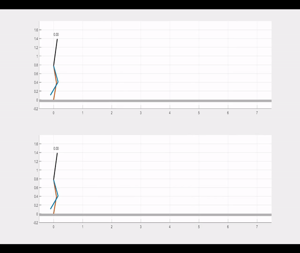

# Slip control

> **Team member:**
> [Sangli Teng](https://github.com/SangliTeng)  [Chenyu Yang](https://github.com/yangcyself)  [Jiaxuan Yang](https://github.com/jiaxuanyang520)  [Chenran Li](https://github.com/chenran-li)   

The PD controller with slippery correction vs. the normal PD controller. On a rigid round with $\mu = 0.25$

## Implementation

### Controller

#### Normal PD controller

Track the reference joint angle

$$
u_{P D}=-K_{P}\left(q-\hat{q}_{d e s}\right)-K_{D}\left(\dot{q}-\dot{\hat{q}}_{d e s}\right)
$$

#### [ETH's method](https://ieeexplore.ieee.org/document/8772165)

Add impedance

$$
u_{E T H}=u_{W B C, r e f}-K_{P}\left(q-\hat{q}_{d e s}\right)-K_{D}\left(\dot{q}-\dot{\hat{q}}_{d e s}\right)
$$

Where WBC: Whole Body Controller and the $\hat{q}_{d e s} \dot{\hat{q}}_{d e s}$ comes from gait library or WBC

#### our method

When the stance leg slips, we want to “drag” it to the original desired place. 

The “drag force” is proportional to the toe slip velocity. 

We modify the reference trajectory for stance leg to cause “drag force”. 

$$
q_{\text {des}, s t}=\hat{q}_{\text {des}, s t}+K_{P}^{f f d} v_{\text {toe}, x}
$$
$$
\dot{q}_{d e s, s t}=\dot{\hat{q}}_{d e s, s t}+K_{D}^{f f d} v_{t o e, x}
$$
$$
u=-K_{P}\left(q-q_{d e s}\right)-K_{D}\left(\dot{q}-\dot{q}_{d e s}\right)
$$

### Reaction Force simulation

We assume the [Coulomb model of friction](https://mech.subwiki.org/wiki/Coulomb_model_of_friction). There are two cases for simulation:
- The reaction force is in the friction cone
- The reaction force is on the friction cone

Both are simulated by solving the dynamic model and rigid contact model together.

The dynamic model is:
$$
M(q)\ddot{q} = F(q,\dot{q}) + G(q) + Bu + J^{T} \Gamma 
$$

#### The reaction force is in the friction cone

This is the case of static friction, the constraint should be the fix of the ground contact point. As the reaction force $\Gamma$ is relatively second degree to this constraint, so the constraint we use is 

$$
\dot{(J\dot{q})} = \dot{J}\dot{q}+J\ddot{q} =0 
$$

Thus, we can simulate the dynamics and the reaction force together with the following equation

$$
\left[\begin{array}c 
M & -J^{T} \\
J & 0
 \end{array}\right] 
\left[\begin{array}c 
\ddot{q}\\
\Gamma 
 \end{array}\right]
 = 
 \left[\begin{array}c 
 G(q)+Bu\\
 -\dot{J}\dot{q}
  \end{array}\right] 
$$

#### The reaction force is on the friction cone

When the ground contact point is sliding or the reaction force under the static friction assumption is outside of the friction cone, then the friction is saturated. 

Then we assume that the $y$ direction of ground contact is fixed and the $sf_{x} = \mu f_{y}$. Where $s$ is the direction of the friction and $\mu$ is the friction coefficient.

We can solve the equation below

$$
\left[\begin{array}c 
M & -J^{T} \\
(J)_{y}  & 0\\
0 & 
\begin{array}c s & -\mu  \end{array}
 \end{array}\right] 
\left[\begin{array}c 
\ddot{q}\\
\Gamma 
 \end{array}\right]
 = 
 \left[\begin{array}c 
 G(q)+Bu\\
 (-\dot{J}\dot{q})_{y} \\
 0
  \end{array}\right] 
$$

#### The unilateral constraint

After computed one of the above cases, we have to check the unilateral constraint. If the $f_{y}<0$, we directly set $f=0$ and recomputed the $\ddot{q}$

## experiments

|  $\mu$  | their controller|their result | our controller | our result
| ---- | ---- | ---- | ---- | ---- |
| 0.55 |  105, 0.6|   |   0.05,0.02  |yes 5/5|
| 0.30 |  105, 0.6|   |   0.05,0.02  |yes 5/5|
| 0.25 |  105, 0.6|   |   0.05,0.02  |yes 5/5|
| 0.15 |  105, 0.6|   |   0.05,0.02  |yes 5/5|
| 0.10 |  105, 0.6|   |   0.05,0.02  |walk long double stand  5/5|
| 0.05 |  105, 0.6|   |   0.05,0.02  |double stand 1/5|
|      |      |      |
> Their controller is the Kp and Kd, our controller is their Kp and Kd adding feedforward with $q$ and $dq$\
> The value in result is the amount of steps in experiment\
> The above result is get under the condition that zero react force above 1e-2\
> Deprecated

**changed the no-force height to 1e-5**

|  $\mu$  | their controller|their result | our controller | our result
| ---- | ---- | ---- | ---- | ---- |
| 0.55 |  105, 0.6|   |   0.05,0.02  |yes 5/5|
| 0.25 |  105, 0.6|   |   0.05,0.02  |yes 15/15|
| 0.15 |  105, 0.6|   |   0.05,0.02  |walk long double stand 3/5|

## install and run

There are some cpp binaries that needs to be compiled in specific enviroments.

Run the [compile.m](Utils\Dynamics\compile.m) in the Utils Dynamics directory and the [Compile.m](Step1.Gait_Library\gen\kinematics\Compile.m) in the step one directory to generate them.

To see the result, simply run the [Sim_RABBIT_walking.m](./Step2.Walking_Controller/Sim_RABBIT_walking.m)

# The old readme
## Leveraging the Template and Anchor Framework for Safe, Online Robotic Gait Design
This code implements a novel method to perform safe, online gait design on a [RABBIT](https://ieeexplore.ieee.org/stamp/stamp.jsp?arnumber=1234651) model in simulation.

## Installation Requirements
To run the code in this repository, you will need the following:
- MATLAB R2017b
- [FROST](https://ayonga.github.io/frost-dev/index.html) for generating robot dynamics and solving offline trajectory optimization problems
- [spotless ](https://github.com/spot-toolbox/spotless) for computing FRS and deriving set inclusion arguments ([provided](https://github.com/pczhao/TA_GaitDesign/tree/master/Utils/spotless))
- [MOSEK](https://www.mosek.com/) for solving SOS programs
- [polyfitn](https://www.mathworks.com/matlabcentral/fileexchange/34765-polyfitn) for fitting polynomial to data ([provided](https://github.com/pczhao/TA_GaitDesign/tree/master/Utils/PolyfitnTools))
## Overview
## 0. Initialization
Properly install the above toolboxes, and run [`install.m`](https://github.com/pczhao/TA_GaitDesign/blob/master/install.m).
To run examples, one can go straight to Step *6. Online MPC*.
### 1. Generating Gait Library
Each trajectory in the *gait library* is parameterized by a pair of *gait parameters* `(p1,p2)`defined as

- `p1`: average horizontal velocity
- `p2`: step length

To solve for a periodic trajectory, change the values of `p1` and `p2` in lines 4 and 5 of [`GL_opt.m`](https://github.com/pczhao/TA_GaitDesign/blob/master/Step1.Gait_Library/GL_opt.m), and run.
### 2. Walking Controller
Walking controller uses PD feedback to track trajectories drawn from the gait library, and is implemented in [`Sim_RABBIT_walking.m`](https://github.com/pczhao/TA_GaitDesign/blob/master/Step2.Walking_Controller/Sim_RABBIT_walking.m). The parameters are:

- `q0`: initial configuration
- `dq0`: initial velocities
- `p1`, `p2`: gait parameters
- `plot_flag`: flag that toggles plotting

### 3. Bounding Dynamics of RABBIT
To generate dynamics of the Symplified Biped Model (SBM) as described in [`SBM_dynamics.pdf`](https://github.com/pczhao/TA_GaitDesign/blob/master/SBM_dynamics.pdf), run [`SBM_dynamics.m`](https://github.com/pczhao/TA_GaitDesign/blob/master/Step3.Dynamics_Bounds/SBM_dynamics.m), which generates
[`SBM_model_unscaled.mat`](https://github.com/pczhao/TA_GaitDesign/blob/master/Step3.Dynamics_Bounds/SBM_model_unscaled.mat) (provided). 

To bound the dynamics error between the RABBIT model and SBM, run [`SBM_bounding_error.m`](https://github.com/pczhao/TA_GaitDesign/blob/master/Step3.Dynamics_Bounds/SBM_bounding_error.m), which generates [`dynamics_error_bound.mat`](https://github.com/pczhao/TA_GaitDesign/blob/master/Step3.Dynamics_Bounds/dynamics_error_bound.mat) (provided).

### 4. Computing Forward Reachable Set (FRS)
Run [`run_FRS_fun.m`](https://github.com/pczhao/TA_GaitDesign/blob/master/Step4.FRS/run_FRS_fun.m)

### 5. Set Inclusion Arguments
To generate the ell-functions:

- Run [`gen_ell.m`](https://github.com/pczhao/TA_GaitDesign/blob/master/Step5.Set_Inclusion/gen_ell.m), which generates [`ell_fun_deg14.mat`](https://github.com/pczhao/TA_GaitDesign/blob/master/Step5.Set_Inclusion/ell_fun_deg14.mat) (provided).
- Run [`gen_ell_y2.m`](https://github.com/pczhao/TA_GaitDesign/blob/master/Step5.Set_Inclusion/gen_ell_y2.m), which generates [`ell_y2_fun_deg12.mat`](https://github.com/pczhao/TA_GaitDesign/blob/master/Step5.Set_Inclusion/ell_y2_fun_deg12.mat) (provided).
- Run [`gen_ell_y3y4.m`](https://github.com/pczhao/TA_GaitDesign/blob/master/Step5.Set_Inclusion/gen_ell_y3y4.m), which generates [`ell_y3y4_fun_deg12.mat`](https://github.com/pczhao/TA_GaitDesign/blob/master/Step5.Set_Inclusion/ell_y3y4_fun_deg12.mat) (provided).

### 6. Online MPC
To generate parameters for MPC optimization, run [`gen_online_parameter.m`](https://github.com/pczhao/TA_GaitDesign/blob/master/Step6.MPC/gen_online_parameter.m), which generates [`online_para.mat`](https://github.com/pczhao/TA_GaitDesign/blob/master/Step6.MPC/online_para.mat) (provided).

To run the proposed method on a speed-tracking problem, run [`run_Example_proposed.m`](https://github.com/pczhao/TA_GaitDesign/blob/master/Step6.MPC/run_Example_proposed.m)

To solve the same problem using naive method, run [`run_Example_naive.m`](https://github.com/pczhao/TA_GaitDesign/blob/master/Step6.MPC/run_Example_naive.m)

## Acknowledgements
Special thanks to my collaborators Jinsun Liu, Zhenyu Gan, Matthew Johnson-Roberson, and Ram Vasudevan.
